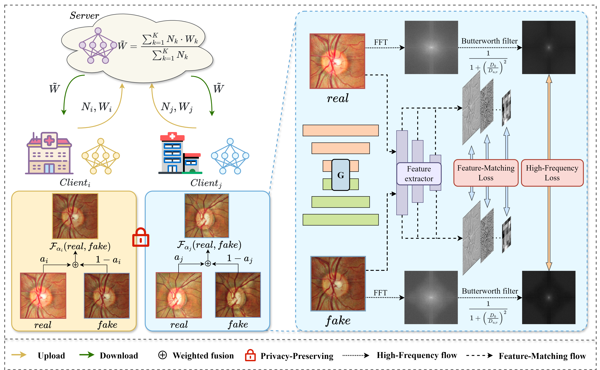
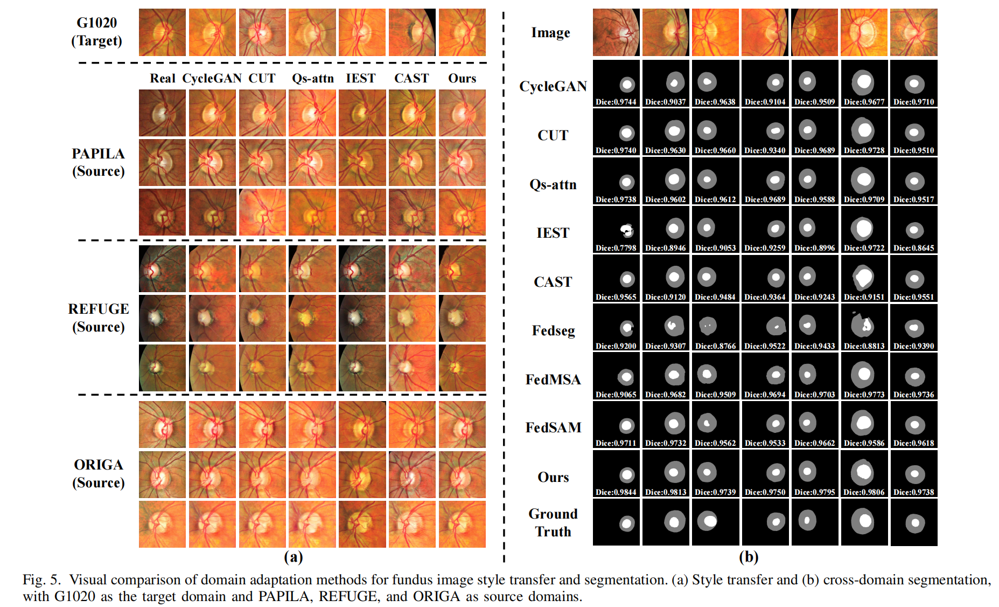
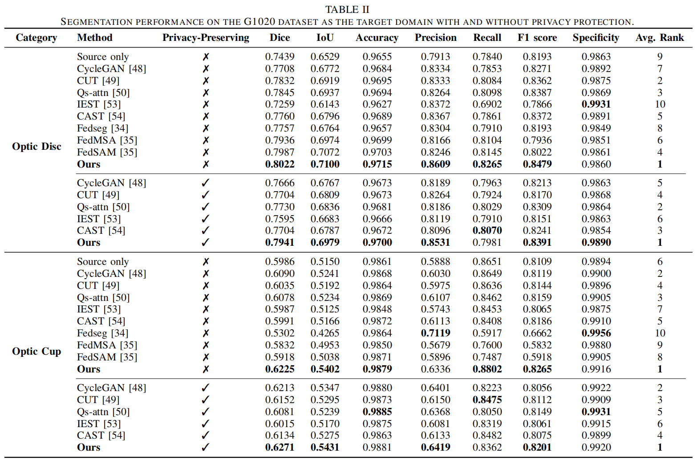
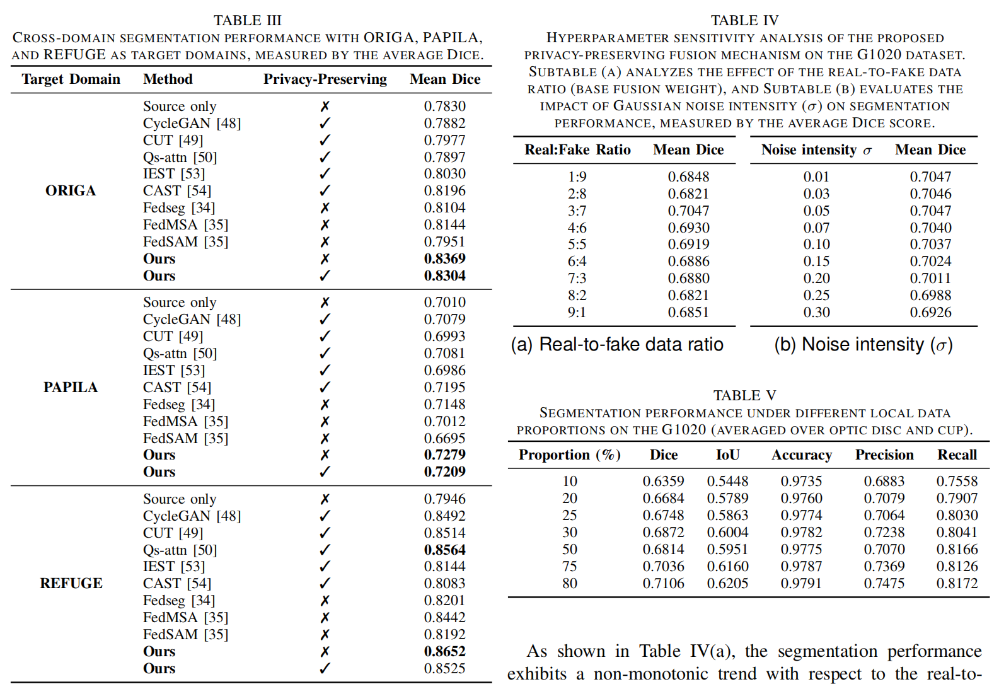

# 🚀 Federated Generation and Fusion for Privacy-Preserving Cross-Domain Multi-Site Optic Disc and Cup Segmentation

This is the official PyTorch implementation for the paper "Privacy-Preserving Federated Generation Framework for Cross-Domain Multi-Site Fundus Image Segmentation"!

## Framework


## Experimental Result





## 🌈 Environment Setup  
### 📦 Dependency Requirements  
- **Python** ≥ 3.8  
- **PyTorch** == 2.4.1  
- Other dependencies are listed in `requirements.txt`. Install them with:  
  ```bash  
  pip install -r requirements.txt  
  ```  

### 🛠️ Hardware Recommendations  
- **GPU** acceleration (recommended for higher training efficiency)  
- Adjust batch size (`batch_size`) for CPU mode  


## 🚀 Fundus Image GAN Training
### 📈 Data Preparation
Place your prepared data in any directory (e.g., `datasets`) with the following structure:
```python
datasets/
├── trainA/    # Source domain training images
├── trainB/    # Target domain training images
├── testA/     # Source domain test images
└── testB/     # Target domain test images
```

### 📝 Configuration Guide  
- **Fundus_GAN/options/base_options.py**
```python
parser.add_argument('--batch_size', type=int, default=1, help='input batch size')
parser.add_argument('--load_size', type=int, default=512, help='scale images to this size')
parser.add_argument('--crop_size', type=int, default=512, help='then crop to this size')
```

- **Fundus_GAN/options/train_options.py**
```python
# training parameters
parser.add_argument('--n_epochs', type=int, default=10, help='number of epochs with the initial learning rate')
parser.add_argument('--n_epochs_decay', type=int, default=10, help='number of epochs to linearly decay learning rate to zero')
```


### 🚦 Training & Testing  
- **Initialize Training**
```bash
python train.py --dataroot your/training/data/address --name the/name/of/the/trained/model
```

- **Continue Training from Pretrained Model**
```bash
python train.py --dataroot your/training/data/address --name the/name/of/the/trained/model --continue_train
```

- **Testing**
```bash
python test.py --dataroot your/training/data/address --name the/name/of/the/trained/model --phase train  # Direction: trainA->trainB
python test.py --dataroot your/training/data/address --name the/name/of/the/trained/model --phase test  # Direction: testA->testB
```

Generated results will be saved in the `results` directory.


## 🚀 Federated Segmentation Model Training  
### 📝 Configuration Guide  

#### 🔍 5-Fold Cross-Validation on a Single Dataset
- **Fed_Unet_Seg/main.py**  
```python  
parser.add_argument('--log_file', type=str, default='log/logfile_name.xlsx', help='Training log file path') # Modify to your log storage path 
parser.add_argument('--federated', action='store_true', default=False, help='Use federated learning')  # Set federated to false
```  

- **Fed_Unet_Seg/train.py** 
```python  
dir_img = Path('your/training/data/address')  # Modify training data address and other parameters
dir_mask = Path('your/training/data_mask/address')
dir_checkpoint = Path('checkpoints/')
checkpoint_name = 'best_seg_model.pth'   # Name of the saved model
```  

#### 🔍 Federated Segmentation Training on Multiple Datasets
- **client_config.json** needs to configure data addresses:
```python
{
    "clients": [
        {
            "name": "data_name1",
            "img_dir": "Image_root1",
            "mask_dir": "Mask_root1"
        },
        {
            "name": "data_name2",
            "img_dir": "Image_root2",
            "mask_dir": "Mask_root2"
        }, 
        ...
    ],
    "server":[
        {
            "name": "data_name",
            "img_dir": "Image_root",
            "mask_dir": "Mask_root"
        }
    ]
}
```

- **Fed_Unet_Seg/main.py**
```python
parser.add_argument('--log_file', type=str, default='log/logfile_name.xlsx', help='Training log file path') # Modify to your log storage path 
parser.add_argument('--federated', action='store_true', default=True, help='Use federated learning')  # Set federated to True
parser.add_argument('--client-config', type=str, default="client_config.json", help='Client configuration file path (JSON format)')
parser.add_argument('--global-epochs', type=int, default=10, help='Number of global training epochs in federated learning')
parser.add_argument('--local-epochs', type=int, default=10, help='Number of local training epochs on clients in federated learning')
```

- **Fed_Unet_Seg/train.py**  Only need to configure the following two items:
```python  
dir_checkpoint = Path('checkpoints/')
checkpoint_name = 'best_seg_model.pth'   # Name of the saved model
```  


### 🚦 Start Training  
```bash  
python main.py  
```  


### 🔬 Single-Sample Testing  
Perform segmentation prediction on a single image:  
```bash  
python3 predict.py -i input.jpg -o output.png  
```  

### 🏃 Batch Testing  
Evaluate the entire dataset:  
1. Modify the configuration in `test.py`:  
   ```python  
   args.test_dir_img = "path/to/test/images/"  # Test image path  
   args.test_dir_mask = "path/to/test/masks/" # Ground truth mask path
   args.pretrained_model_path = "checkpoints/best_model.pth"  # Load the trained model  
   ```  
2. Run the command:  
   ```bash  
   python test.py  
   ```  

## 📁 File Structure  
```  
project_root/  
├── Fed_Unet_Seg/                # Federated Learning UNet Segmentation Model Module  
│   ├── model/                   # UNet model core implementation (architecture definition)  
│   ├── utils/                   # Helper utility functions (data processing/visualization, etc.)  
│   ├── client_config.json       # Federated learning client configuration (device parameters/communication settings)  
│   ├── main.py                  # Main controller for federated training process (coordinates clients and server)  
│   ├── predict.py               # Single-sample inference demonstration (input image → segmentation result)  
│   ├── test.py                  # Model performance evaluation (batch testing + metric calculation)  
│   └── train.py                 # Core training logic (data loading/loss function/optimizer)  
│  
├── Fundus_GAN/                  # Fundus Image Generative Adversarial Network Module  
│   ├── checkpoints/             # Model weights saved during training (by epoch)  
│   ├── data/                    # Original dataset storage directory (can link external storage)  
│   ├── datasets/                # Processed dataset (split into training/validation/test sets)  
│   ├── models/                  # GAN model architecture definition (generator/discriminator)  
│   ├── options/                 # Training/testing configuration parameters (hyperparameters/path settings)  
│   ├── results/                 # Generated results and visualizations  
│   ├── util/                    # Utility functions (image IO/metric calculation/logging)  
│   ├── test.py                  # GAN model testing and evaluation  
│   ├── tox.ini                  # Automated test environment configuration  
│   └── train.py                 # GAN training loop (adversarial training logic)  
│  
├── README.md                    # Project overview and usage guide  
└── requirements.txt             # Environment dependency list (Python package versions)  
```  


## ⚠️ Notes  
1. **Data Paths**: Ensure training/test data paths are correct and file naming is standardized (e.g., `image_001.jpg` corresponds to `mask_001.png`).  
2. **Model Compatibility**: Use the same PyTorch environment version as during training to avoid weight loading errors.  
3. **Image Sizes**: For batch testing, input images should preferably have uniform sizes, or add dynamic Resize logic to the data loader.  
4. **Privacy Protection**: This framework is designed based on federated learning to ensure data stays local. Configure multi-node communication parameters during training (see paper for details).  


## 📖 Reference Projects  
- [PyTorch UNet](https://github.com/milesial/Pytorch-UNet) 
- [CycleGAN](https://github.com/junyanz/pytorch-CycleGAN-and-pix2pix)
- [CUT](https://github.com/taesungp/contrastive-unpaired-translation)
- [QS-Attn](https://github.com/sapphire497/query-selected-attention)

## 📕 Public Datasets Used  
- [G1020, ORIGA, REFUGE](https://www.kaggle.com/datasets/arnavjain1/glaucoma-datasets)
- [PAPILA](https://www.kaggle.com/datasets/orvile/papila-retinal-fundus-images)

## 📧 Contact  
For questions or suggestions, please contact:  
📩 [yanhanhu@stu2022.jnu.edu.cn](mailto:yanhanhu@stu2022.jnu.edu.cn)  

**🌟 Welcome to Star this project! If the code helps you, please give it a ⭐ to support open source!**
